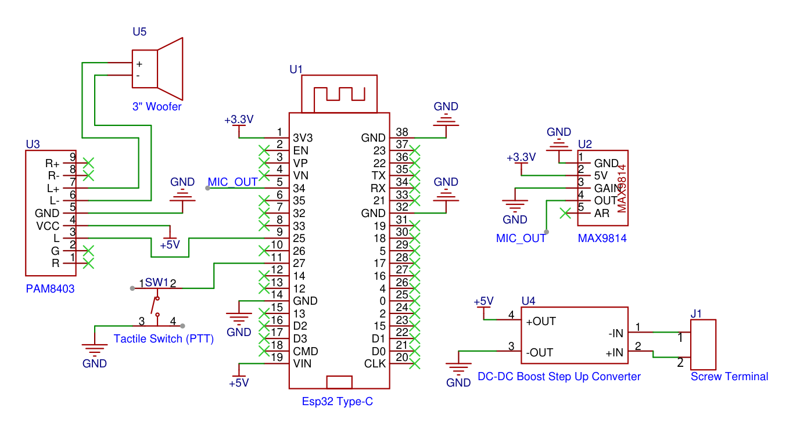

# Walkie-talkie using ESPNOW

**Half-duplex push-to-talk voice transceiver over ESP-NOW, built on two ESP32 boards.**


This project streams live microphone audio between two ESP32 units with no router, no
pairing step and no extra radio module. It uses the ESP32's built-in 2.4 GHz radio in
ESP-NOW broadcast mode, a software audio front end (DC removal, low-pass filter, noise
gate), and the ESP32's on-chip 8-bit DAC feeding a small class-D amplifier.

---

## Specifications

| Parameter | Value |
|---|---|
| MCU | ESP32 (classic, dual-core Xtensa, with on-chip DAC) |
| Radio | ESP-NOW, unacknowledged broadcast, Wi-Fi channel 1 |
| Topology | Point-to-point, half-duplex, push-to-talk |
| Audio sample rate | 16 kHz |
| Sample format | 8-bit unsigned PCM |
| Raw audio bit rate | 128 kbit/s |
| Packet payload | 129 bytes (1 byte type + 128 samples) |
| Packet duration / rate | 8 ms of audio, 125 packets/s |
| Buffering delay (design value) | about 40 ms (8 ms packetization + 32 ms jitter buffer), not yet measured end to end |
| Talk-permit delay | about 130 ms after button press (control packets + beep) |
| ADC | 12-bit, GPIO34 (ADC1), 11 dB attenuation, 2x averaged |
| DAC | 8-bit, GPIO25 |
| Microphone | MAX9814 (electret + AGC, 40/50/60 dB gain) |
| Amplifier | PAM8403 class-D module with volume knob |
| Power | ESP32 from USB or VIN; amp from a separate 3.7 V Li-ion cell |

---

## System architecture

```
   TRANSMIT UNIT                                              RECEIVE UNIT
 +---------------+   +---------------------------+          +---------------------------+   +-----------+
 | MAX9814 mic   |-->| ESP32                     |          | ESP32                     |-->| PAM8403   |--> Speaker
 | AGC 50 dB     |   | ADC -> DC block -> LPF -> |  ESP-NOW | RX callback -> ring buf   |   | class-D   |
 +---------------+   | noise gate -> 8-bit pack  |=========>| -> prebuffer -> DAC       |   | + knob    |
                     +---------------------------+  2.4 GHz +---------------------------+   +-----------+
                              ^
                        PTT button (GPIO27)          Both units run the same firmware and
                                                     switch roles on the button state.
```

---

## Hardware

### Schematic



### Bill of materials (per unit, build two)

| Part | Qty | Notes |
|---|---|---|
| ESP32 Dev Kit | 1 | Must be a classic ESP32 (GPIO25 DAC). S2/S3/C3 will not work as-is |
| MAX9814 microphone module | 1 | GAIN pin to GND for 50 dB |
| PAM8403 amplifier module with pot | 1 | Powered from the battery, not from the ESP32 |
| 8 ohm speaker | 1 | Small enclosure improves clarity |
| Tactile push button | 1 | Active low, internal pull-up |
| 3.7 V Li-ion cell | 1 | Amp supply, 2.5 V to 5.5 V allowed |
| 10 uF and 100 nF capacitors | optional | Decoupling across MAX9814 VDD and GND |

### Pin map

| ESP32 pin | Function | Connects to |
|---|---|---|
| 3V3 | Mic supply | MAX9814 VDD |
| GND | Common ground | MAX9814 GND and GAIN, amp G, amp Power -, battery -, button |
| GPIO34 | ADC1 input | MAX9814 OUT |
| GPIO25 | DAC1 output | PAM8403 L input |
| GPIO27 | Push-to-talk input | Button to GND |
| GPIO2 | Transmit LED | Onboard LED |

### Amplifier and speaker

| Amp pin | Connects to |
|---|---|
| L (input) | ESP32 GPIO25 |
| G (input ground) | ESP32 GND |
| Power + | Battery + |
| Power - | Battery - (also joined to ESP32 GND) |
| Lout +, Lout - | Speaker terminals |

The unused third input pin (R) is left open.

### Wiring rules that mattered in testing

- Power the amp from the battery, never from the ESP32 3V3 pin.
- Join all grounds at one point.
- Keep the mic wire and the speaker wires apart. A floating mic OUT connection produces
  loud hiss.
- During bring-up, the board showed boot loops (`invalid header: 0xffffffff`,
  `flash read err`) after wiring changes. Re-flashing with **Erase All Flash** enabled and
  adding parts back one at a time cleared them.

---

## Signal processing

Notation: $f_s = 16000$ Hz, $x[n]$ is the averaged 12-bit ADC reading.

**Input averaging.** Two ADC conversions per sample reduce random converter noise:

$$x[n] = \tfrac{1}{2}\left(\mathrm{ADC}_1[n] + \mathrm{ADC}_2[n]\right)$$

**DC removal.** The MAX9814 output is biased at about 1.25 V. A running mean tracks the
bias and is subtracted:

$$\bar{x}[n] = \bar{x}[n-1] + \alpha_{dc}\left(x[n] - \bar{x}[n-1]\right), \qquad a[n] = x[n] - \bar{x}[n]$$

with $\alpha_{dc} = 0.0005$, giving a corner frequency near

$$f_{dc} = \frac{\alpha_{dc} f_s}{2\pi} \approx 1.3\ \text{Hz}$$

**Low-pass filter.** A one-pole IIR filter removes high-frequency hiss and aliasing:

$$y[n] = y[n-1] + \alpha_{lp}\left(a[n] - y[n-1]\right)$$

The cutoff frequency is

$$f_c = -\frac{f_s}{2\pi}\ln(1 - \alpha_{lp})$$

With $\alpha_{lp} = 0.8$ this gives $f_c \approx 4.1$ kHz.

**Noise gate.** An envelope follower tracks signal level:

$$e[n] = e[n-1] + 0.05\left(|y[n]| - e[n-1]\right)$$

The gate opens when $e > 25$ and closes when $e < 15$ (ADC counts, hysteresis). The gate
gain $g[n]$ ramps toward 1 with coefficient 0.05 (attack) and toward 0 with coefficient
0.002 (release), so it produces no clicks.

**Output scaling.** The signal is converted from 12-bit to 8-bit, with a software gain
$G$ (default 3), and re-centred at mid-scale:

$$s[n] = \mathrm{clip}\left(128 + \frac{G\, g[n]\, y[n]}{16},\ 0,\ 255\right)$$

**Data rate.**

$$R = f_s \times 8\ \text{bit} = 128\ \text{kbit/s}, \qquad \text{packet rate} = \frac{f_s}{128} = 125\ \text{pkt/s}$$

---

## Radio protocol

All frames are ESP-NOW broadcast to `FF:FF:FF:FF:FF:FF` on Wi-Fi channel 1, unencrypted.
Broadcast frames are not acknowledged, so packet loss shows up as short audio gaps.

| Type byte | Name | Payload | Purpose |
|---|---|---|---|
| `0x01` | START | none | Talker pressed the button. Receiver plays the incoming beep |
| `0x02` | AUDIO | 128 x uint8 samples | 8 ms of audio |
| `0x03` | END | none | Talker released the button. Receiver drains its buffer, then plays the "over" beep |

START and END are each sent 3 times, 3 ms apart, to survive single-frame loss.

### Transmit sequence

1. Button debounced low, so enter transmit mode and light the LED.
2. Send START x3, play a local "you are live" tone (60 ms), wait 60 ms so the receiver
   can finish its beep.
3. Sample at 16 kHz using a `micros()` schedule, process, and send one AUDIO frame per
   128 samples.
4. Button high for 30 ms means released. Send END x3 and return to receive mode.

### Receive sequence

1. The ESP-NOW callback pushes AUDIO samples into a 2048-sample ring buffer (128 ms).
2. START triggers the incoming beep. A missed START is recovered when audio arrives.
3. Playback starts once 512 samples (32 ms) are buffered, and outputs one DAC sample
   every 62.5 us.
4. On underrun the DAC holds mid-scale and the buffer refills before playback resumes.
5. END, or 500 ms without any packet, drains the buffer and plays the "over" beep.

---

## Repository layout

```
walkie-talkie-using-espnow/
├── README.md
├── LICENSE
├── .gitignore
├── firmware/
│   └── walkie_talkie_espnow/
│       └── walkie_talkie_espnow.ino
└── docs/
```

---

## Build and flash

1. Install the Arduino IDE 2.x and the **esp32 by Espressif** board package. No other
   libraries are required. ESP-NOW is part of the core.
2. Select **ESP32 Dev Module** and the correct COM port.
3. Open `firmware/walkie_talkie_espnow/walkie_talkie_espnow.ino` and upload the
   **same sketch to both boards**.
4. Open the Serial Monitor at 115200 baud. Each unit prints its MAC address and
   `Ready. Hold the button to talk.`

If upload stalls at `Connecting......`, hold the BOOT button until the transfer starts.

---

## Usage

Hold the button and speak after the beep. Release to listen. The receiving unit plays a
two-tone incoming beep, then your voice, then a short "over" beep. Test with the units in
different rooms, or with one volume knob at minimum, to avoid acoustic feedback.

Serial log example:

```
TX: start
TX: end, audio packets sent: 625
RX: start
RX: done, audio packets received: 620
```

(About 625 packets for a 5 second press: 5 s x 125 packets/s.)

---

## Tuning

Constants at the top of the sketch:

| Constant | Default | Effect |
|---|---|---|
| `SAMPLE_RATE` | 16000 | Audio bandwidth and CPU load |
| `SOFT_GAIN` | 3.0 | Microphone level |
| `LP_ALPHA` | 0.8 | Low-pass cutoff. Higher is brighter, lower is less hiss |
| `GATE_OPEN` / `GATE_CLOSE` | 25 / 15 | Noise gate thresholds in ADC counts |
| `PREBUFFER` | 512 | Jitter buffer depth. Raise it if you hear dropouts |
| `BEEP_VOL` | 60 | Beep loudness |

Symptom guide:

| Symptom | Adjustment |
|---|---|
| Muffled voice | Raise `LP_ALPHA` (0.8 to 0.9), raise `SAMPLE_RATE` |
| Hiss when idle or speaking | Lower `LP_ALPHA`, raise `GATE_OPEN` and `GATE_CLOSE`, set MAX9814 GAIN to 40 dB |
| Start of words cut off | Lower `GATE_OPEN` and `GATE_CLOSE` |
| Howl or squeal | Separate the units, lower the amp knob, lower `SOFT_GAIN` |
| Slow, deep voice | ADC too slow for the rate. Use one ADC read per sample or `SAMPLE_RATE` 12000 |
| Choppy audio | Raise `PREBUFFER`, reduce distance |

---

## Improving audio quality (software tweaks)

Work through these in order. Change one constant at a time, upload to **both** boards, and
listen before changing the next. Audio quality here is limited by the 8-bit DAC and a small
speaker, so the goal is a clear, intelligible voice rather than hi-fi.

### 1. Set the audio bandwidth (fixes muffled voice)

Speech intelligibility depends on frequencies up to about 3.5 kHz, and consonants such as
"s", "t" and "f" sit above 2.5 kHz. Two constants decide how much of that survives:
`SAMPLE_RATE` (must be at least twice the highest frequency) and `LP_ALPHA` (low-pass
cutoff):

$$f_c = -\frac{f_s}{2\pi}\ln(1 - \alpha_{lp})$$

Cutoff for common values at $f_s = 16$ kHz:

| `LP_ALPHA` | Cutoff $f_c$ | Sound |
|---|---|---|
| 0.5 | about 1.8 kHz | Very muffled, very little hiss |
| 0.6 | about 2.3 kHz | Muffled |
| 0.7 | about 3.1 kHz | Telephone-like |
| 0.8 | about 4.1 kHz | Default, clear speech |
| 0.9 | about 5.9 kHz | Bright, more hiss |

If the voice is still dull at 0.9, check that the ADC keeps up with the sample rate (see
step 5).

### 2. Tune the noise gate (fixes idle hiss and cut-off words)

The gate silences the output when nobody is speaking. Two failure modes:

- Hiss between words: `GATE_OPEN` is too low. Raise `GATE_OPEN` and `GATE_CLOSE` together
  (for example 35 / 20), keeping `GATE_CLOSE` below `GATE_OPEN`.
- Word beginnings clipped: `GATE_OPEN` is too high. Lower both (for example 15 / 8).

To find the right values, print the envelope `env` in `doTransmit()` while holding the
button in a quiet room, then while speaking, and put `GATE_OPEN` between the two readings.
Do not print to Serial during normal use, because it interrupts the sample timing and adds
crackle.

### 3. Set gain without clipping

`SOFT_GAIN` multiplies the filtered signal before it is scaled to 8 bits:

$$s[n] = \mathrm{clip}\left(128 + \frac{G\, g[n]\, y[n]}{16},\ 0,\ 255\right)$$

- Too low: the voice is quiet and the noise floor is a large share of the signal.
- Too high: loud speech reaches 0 or 255 and is clipped, which sounds harsh and distorted.
  Lower `SOFT_GAIN` if the voice sounds "buzzy" when you speak loudly or close to the mic.
- Software gain also amplifies noise. For a quiet voice, prefer raising the volume knob on
  the amplifier, or the MAX9814 GAIN pin (GND = 50 dB, floating = 60 dB), over a large
  `SOFT_GAIN`.

Good starting range: `SOFT_GAIN` 2 to 4.

### 4. Size the jitter buffer

The receiver waits for `PREBUFFER` samples before playing, which adds delay but absorbs
lost or late packets:

$$t_{buffer} = \frac{\text{PREBUFFER}}{f_s}$$

At 512 samples and 16 kHz this is 32 ms. If you hear dropouts or stutter, increase it to
768 or 1024 (48 to 64 ms). If the conversation feels laggy, decrease it to 384. The ring
buffer (`RB_SIZE`, 2048 samples) must stay larger than `PREBUFFER`.

### 5. Keep the sample timing exact

The sketch samples on a `micros()` schedule. If the loop cannot finish within one sample
period $1/f_s$, the effective sample rate drops and the voice sounds slow and low-pitched.

- Each sample uses two ADC reads. If the voice is slow, use one read per sample: replace
  `(analogRead(PIN_MIC) + analogRead(PIN_MIC)) * 0.5f` with `analogRead(PIN_MIC)`, or
  reduce `SAMPLE_RATE` to 12000.
- Keep `Serial.print` calls out of the transmit loop and out of the audio playback path.
- Do not add long `delay()` calls in `loop()`.

### 6. Optional code changes to try

These are not in the default sketch and have not been tested on the hardware. Try one at a
time.

**Hold the last sample on underrun.** When the buffer runs dry, the receiver currently
outputs mid-scale (128), which can produce a click. Holding the last value is quieter.
Add `static uint8_t lastOut = 128;` in `doReceive()`, set `lastOut = rb[tail];` when a
sample is played, and write `dacWrite(PIN_DAC, lastOut)` instead of `128` on underrun.

**Pre-emphasis for a brighter voice.** A gentle high-frequency boost before the low-pass
filter can counter the dull sound of the DAC and speaker:

$$a'[n] = a[n] - \beta\, a[n-1], \qquad \beta \approx 0.3 \text{ to } 0.5$$

It also boosts hiss, so raise `GATE_OPEN` and `GATE_CLOSE` after enabling it.

**Simple output smoothing.** Averaging each received sample with the previous one (a
two-point moving average) removes some of the 8-bit stair-step noise at the cost of some
brightness.

### 7. Hardware that helps as much as software

- Speak 5 to 10 cm from the MAX9814. Too close overloads it, too far picks up room noise.
- Mount the speaker in a small closed enclosure. A bare speaker in open air sounds thin.
- Put a 10 uF and a 100 nF capacitor across MAX9814 VDD and GND, and keep the mic wires
  short and away from the speaker wires.
- An RC low-pass on the DAC output (about 470 ohm in series with 47 nF to ground) smooths
  the stair-step quantisation noise.
- Longer-term, an I2S microphone and an I2S amplifier remove the 8-bit DAC limit (see the
  roadmap).

### Recommended tuning procedure

1. Start with the defaults (`SAMPLE_RATE` 16000, `LP_ALPHA` 0.8, `SOFT_GAIN` 3).
2. Set the amplifier knob to a comfortable level, then adjust `SOFT_GAIN` until loud speech
   does not distort.
3. Adjust `GATE_OPEN` and `GATE_CLOSE` until idle hiss disappears and word starts are not cut.
4. Adjust `LP_ALPHA` for the best balance between clarity and hiss.
5. Adjust `PREBUFFER` until dropouts stop with the lowest delay.

---

## Known limitations

- Half-duplex only. The transmitting unit cannot hear the other side.
- 8-bit linear PCM, no compression. Audio quality is limited by the on-chip DAC.
- Broadcast frames are unencrypted and unacknowledged. Any ESP32 on channel 1 can listen.
- Any number of receivers will hear a talker, but there is no arbitration between
  simultaneous talkers.
- Range has not been characterised yet.

---

## Development notes

The first design used nRF24L01+ modules over SPI (CE GPIO4, CSN GPIO5, SCK 18, MOSI 23,
MISO 19). It was abandoned after testing:

- SPI communication and chip detection worked, with correct register configuration.
- The sender never received an ACK, and the receiver never detected a carrier on the
  channel (`testRPD()` always false), at 1 Mbps and 250 kbps, on channels 76 and 100.
- The root cause was not identified. Faulty or counterfeit modules are one possible
  explanation; a known-good pair would confirm it.

Switching to ESP-NOW removed the external module and the SPI wiring, and worked on the
first test.

An ESP8266 cannot be used for this design: it has no DAC and a single 10-bit ADC with a
1 V input range.

---

## Roadmap

- [ ] ADPCM compression (4 bits per sample) to halve the air data rate
- [ ] ESP-NOW encryption with a shared key
- [ ] Voice-activated transmit option
- [ ] Digital I2S microphone (INMP441) and I2S DAC amplifier (MAX98357A) for higher audio quality
- [ ] Received signal strength indicator and link-quality LED
- [ ] Range test and results table
- [ ] Custom PCB

---

## License

MIT. See `LICENSE`.
